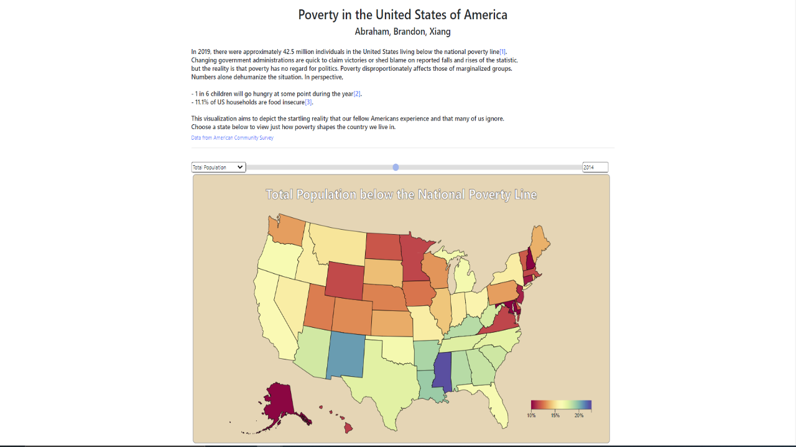
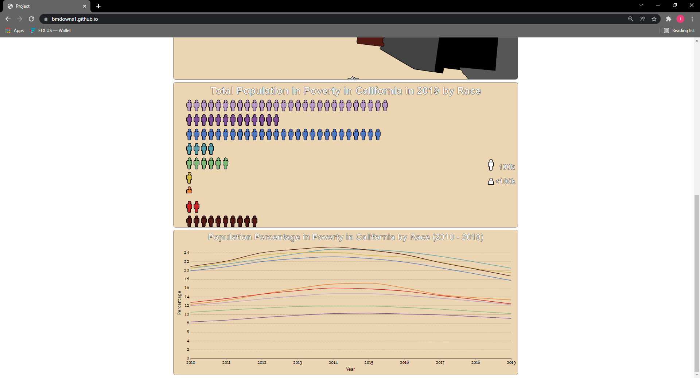

# Poverty in the United States of America

View it on GitHub Pages [Here](https://abrahamc72.github.io/DataVizProj/)

## Overview and Summary

We created a visualization dashboard of the population of those experiencing poverty in the United States of America. The project filters specific years and states by
marginalized subsets in percentage and population form. The dashboard’s basis functions as a navigation hub; it is a choropleth map of the United States consisting of 5
curated datasets chosen specifically because of their interesting and relevant disparities across the country. The chosen state uses a ‘select-highlight approach to 
display percentages for a specific year in an innovative stacked bar chart with an accompanying aggregate population pictograph to give perspective on the total population
breakdown in relation to the percentages. Alongside each focused state is a cumulative line graph of the total range of years. 

## Data Description

The data was collected from the American Community Survey at this link, which is no longer available as of 12/2/2021 at 11:00 pm. I attempted to discuss this with Dr. Bryan during 
office hours after the link had been removed on 12/2/2021 to a new link. However, to supplment this inconvience, I will provide a link to the team's spreadsheet data in raw form. 

[Original Link No Longer Available from American Community Survey at data.census.gov](https://data.census.gov/cedsci/table?q=historical%20poverty%20by%20state%20by%20year&t=Income%20and%20Poverty&g=0400000US01,02,04,05,06,08,09,10,12,13,15,16,17,18,19,20,21,22,23,24,25,26,27,28,29,30,31,32,33,34,35,36,37,38,39,40,41,42,44,45,46,47,48,49,50,51,53,54,55,56&tid=ACSST1Y2019.S1703&hidePreview=true&moe=false)

[Google Sheets Raw Data Transposed](https://docs.google.com/spreadsheets/d/17LMrujgYMYdJb0758oR_wlQjbZVvvrg7uJ7xlfj_dNA/edit?usp=sharing)

[Map Geo Data.json](http://bl.ocks.org/michellechandra/0b2ce4923dc9b5809922)

The dataset for this visualization is aimed at individuals interested in the situation of poverty in the United States. The domain users include any and all citizens of the
United States, as well as those interested in the socioeconomic situation of the United States. In total, it applies to a majority of viewers. The users of this visualization
are primarily concerned with this dataset because it depicts an increasingly relevant situation of wealth inequality in the United States, a topic that continues to be in the
forefront of political, cultural, economic, and racial discussion. The data is shown in the form of a choropleth map, line chart, and stacked bar chart as percentages and as a
pictograph in the form of aggregate population below the national poverty line for the specific year between 2010 and 2019. Color is a key component of the visualization. Color
separates specific groups from one another when a specific state is being focused, as well as to depict the relative magnitude of an overall state’s specific percentage in
relation to another state. User manipulation of the dataset occurs with interaction by focusing on states, highlighting states, and shifting the specific subgroup to filter the
dataset. 

The data includes the percentages and population in poverty below the national poverty line for the following attributes: Total Population, Male, Female, Under 18, 18 to 64, 65
and up, White, Black, Native American, Asian, Pacific Islander, Other, Two or More, Hispanic/Latino, White alone, not Hispanic, < High School, High School, Some College, >=
Bachelor, Native, Foreign born, Disability, No Disability, Full-Time, Part-Time, No Work.

These attributes were split into encompassing categories of Race, Age, Education Level, Sex, Nativity Status, Employment Status, and Disability Status for each of the 50 states.

The two sets of data, being the population and percentages are from the same datatable. The datatable originally shows over 35 specific subgroups in over 9 specific categories
of the form Race, Sex, Disability, Work Status, etc for 50 states as well as Puerto Rico and D.C. We cleaned this data to 7 specific categories of 30 subgroups with a total for
50 states over 10 years. Considering each of the 7 categories as an attribute, the cardinality of 50 states varies from 2 on the low end (Sex, Disability) to 9 on the high end
(Race). In total, there are 14,500 individual data points (50 States * 29 categories * 10 Years) with a total cardinality of 290 for each state (29 sub-categories * 10 years)
and a categorical cardinality of 70 for each state (7 categories * 10 years).

In the original form, the data was presented as a total of each group e.g. 2,289,937 males in Alabama in 2019. Alongside the data was a percentage of that category in poverty
for the given subgroup and state for the year. The total was pulled to a spreadsheet for each year multiplied by the percentage to calculate the total in poverty, and the
percentage alone was pulled to an accompanying spreadsheet. This data transformation allowed for both percentage and total population data to be represented in the
visualization, when only percentage was originally available in the data.

The final geo json final was used to create a series of polygons to represent the geographic area of each state selectable in the choropleth map and stacked bar chart
visualization. No cleaning was done here, as the json was in a form compatible with d3. 

This project utilizes 2 data manipulation algorithms. The first is one that separates each state’s specific data into an object literal for instant access based on the states index. As a result, all data access is done in O(1) by accessing the specific data index. As a result, there are little to no loops in the data that iterate through the state data structure. The second and perhaps the most key data algorithm in this visualization is the one concerned with the visualization’s stacked bar chart. This is an innovative view and resulted in only a handful of methods of approach. The majority of methods were taxing to the runtime and overly complex. The stacked bar chart is calculated as a percentage of the subgroup in poverty in relative magnitude to its other subgroups. The zoom feature is very taxing in terms of runtime, so the algorithm that calculates the stacked bar chart and accordant tooltips needed to be extremely fast to maintain the speed and accuracy of the intended visualization. Each percentage is calculated with relative magnitude in relation to other subgroups out of 100. Then the values are calculated into a gradient with hard stops. As a result, the tooltip needed to be hard-coded to increase runtime as the color is now a gradient and not a d3 selectable object. The final approach was an original one that is on par with d3’s “object on mouse-event” implementation in terms of speed and complexity. This makes use of the current y-value of the mouse cursor in relation to the top of the focused state and bottom of the focused state. The gradient was a summation of pixels from 0 to the max; the array’s percentages are worked ‘backwards’ in a dynamically sized switch to calculate the mouse’s position on the gradient. In total, this results to an extremely efficient tooltip calculation, one that is O( # of subgroups * 2), comparable in speed/complexity to d3’s traditional object-based implementation.

## Goals and Tasks
The goal of our project is to depict the startling reality of the poverty disproportion across the United States. We decided to accomplish this goal by drawing different data visualizations that can clearly show the problem of poverty disproportion in the United States. Hence, we first found a dataset from the American Community Survey that was collected by the United States Census Bureau. This dataset contains detailed information about the percentage of people who lived in poverty in each state from 2010 to 2019, and it categorized the numerical data of people who lived in poverty into multiple labels that each label shows the percentage of people who lived in poverty from the perspective of the label indicated. After a decent amount of manipulation and cleaning, the data was transposed into a series of sheets of both population total and percentage. From here, we wanted to start on a dashboard.

The aim of our system was one where the user could navigate other smaller visualizations from our intuitive visualization. While other groups may use other well know visualization methodologies as the dashboard component, we wanted to challenge ourselves by making our intuitive component the forefront of the project. We originally decided on pie charts, but quickly realized ‘its hard to have a pie chart in the shape of Florida’. So, we went with a stack barchart approach, which actually ended up working out better, as a pie chart is more intuitive as parts of a whole, and our data was not really parts of a whole. At this point, we had a map feature with zoom planned as well as a line chart. We had not yet brainstormed a method for using the population data uniquely. We decided an interesting way to depict this would be a pictograph, a visualization type that is super-digestible but rarely used. 

Because our domain users are the general population and poverty is the project, we wanted each visualization to have ‘digestion’ at its focus. After all, not every person is able to afford the education to understand complex visualizations. Of course, visualizations can be crafted to be more intuitive, but ones that are inherently intuitive were prioritized. A map is as basic as it gets, and a pictograph follows in the same footsteps. A line chart was the only method where we could graph data over time in a more numerical form yet comparative in terms of years, so we deviated from this ‘digestible’ aim but only just so. The stack bar chart as a function of choropleth map came out of the condensing of our WIP report. Originally, we had planned a storyboard feature that had included a pie chart, but after reviews from the TA and Dr. Bryan, we decided against it. We swapped gears to a dashboard and our project went all the better. Our visualizations were easily more linkable and the focus of the project became clear. In total, our aim for the project was met in our eyes. A visualization of poverty that is digestible by individuals of all backgrounds and education, with the aim of informing the domain users at the heart of each visualization. 

## Idioms
The overarching interface for the dashboard display is a choropleth map of state selections. From the UI elements, the users can select and filter from a variety of curated datasets. These were chosen because of their interesting or relevant disparities from state to state. The choropleth is percentages so comparing state to state is relevant only in terms of these percentages, not data. It would be trivial otherwise e.g. California has more impoverished individuals than Idaho. Duh. The slider and year select allow for a linked dual-combo that allows the user to change and adjust the current year selection. Users can opt for either and the visualization responds accordingly. This slider and input box will adjust the year for both the map and pictograph visualizations. 
	From this point, the user can hover over states in the choropleth map to view the specific percentage of impoverished individuals in the state from the 5 curated datasets. The map includes additional highlighting by adjusting the stroke of the state to indicate a hover. Once a click is registered, the map will ‘zoom’ transform onto the state chosen in an accordant customized zoom to position the state at over three-quarters of the allotted SVG space. All states not focused will be reduced to a greyscale of the choropleth selection in a faded transition. This was done so as to reduce the noise of the stacked bar chart colors in relation to the variating choropleth colors. From here, the stacked bar chart innovative feature will be calculated and displayed as a gradient. The user can hover over specific sections of the hard-stopped gradient to view yet another set of dynamically calculated tooltips to view percentages of impoverished individuals in each subcategory in each state. From here the user can adjust the selected category to one of seven to explore differing marginalized groups relating to others. Clicking the left, category, or right arrow will adjust the selected bar chart to reflect the chosen category and adjust the remaining visualizations below in real-time. Clicking out of the United States or on the ‘X’ will zoom the map back out and restore the color scale from grayscale to the choropleth scale. Additionally, changing the selected curated dataset in the choropleth from the HTML UI elements while inside a zoom will adjust the map in real time without the user even realizing. This is an added feature just to make the UI as seamless as possible. As the user adjusts the select category, the tooltips of the stacked bar chart will adjust accordingly as well and be calculated in real time. The user can adjust the time slider or input box to change the stacked bar chart to view changs in subcategory percentages. This time change is also reflected in the grayscale choropleth map, though it might be difficult to tell. Once again, this was an added UI element just to complete the seamlessness. From here the user can hover over other states that will ‘fill’ back to their original color in the choropleth map and reduce back to their grayscale coloring on mouseoff. This is again, a functionality included just to express the UI consideration on highlight-overview. The goal of this project was to create an extremely intuitive project usable by any and all domain users. It’s in this regard that all UI features are meant to be as seamless and intuitive as possible. Clicking on another state while zoomed on a state will transition the zoom over to that state and adjust the graphs below accordingly to that state. All in all, the Choropleth-Stacked-Barchart Focus Visualization yields an entirely intuitive and innovative take on visualizing in a map-format. 
	The pictograph below represents the population of a given state in each subcategory for a given category for a given year. Changing in real time from the time slider and input box, the selected state in the map, and the selected category in the map, the pictograph will dynamically adjust the number of ‘human’ representing SVGs to represent a supplementary visualization of the relative magnitude of population in relation to the percentages visible in the map. 
	Below that is our line graph, a representation that repeats the information of the graph but in a format that can be used to compare a series of years. The map and stacked bar chart do not allow for an accurate representation of the change in poverty percentages over time, as a simple transition of color is utilized. The line graph serves to fill that gap by displaying the data of each subcategory for a given state for a given category over the duration of the year range. Doing so provides support for the weakness of representation of the choropleth and stacked barchart graph. After all, color change is not an accurate representation of changing quantities, and the pictograph only serves as a supplementary visualization of the magnitude of the stacked bar chart format. This way, each basis of visualization and comparison is covered. 

In total, we have provided the ability for the user to compare relevant and pertinent information from state to state across years and to focus a state and review/compare categories and subcategories of marginalized groups over time in population and percentage form. Finally, we provided a method for the user to view all of this information over time to compare a data set at a given time to a data set at another given time. In total, we allow for cross-state cross-category and cross-chronological comparison of the percentage and population of individuals in poverty.

As stated in a prior section, the main algorithms utilized to support the idioms and features of the visualization are the data structure algorithm that allows for easy indexing and O(1) access time and the original stacked bar chart gradient and tooltip calculation algorithm which runs in a complexity comparable to d3’s on mouse event functionality. Speed was extremely important as the zoom functionality and facets of the map element were very taxing. Therefore, all access and manipulation needed to be as efficient as possible.

## Brief Explanation of Showcased Idioms

### 1: Choropleth and Dropdown of Curated Datasets
Here we have the choropleth map and its accompanying scale of a colorblind-supported color pallete. The values of the choropleth map are the Spectral color pallete via D3. Showcased is the dropdown menu of curated data sets chosen specifically for their relevant disparities between states and each other. Choosing a specific dropdown will color transition the choropleth to the chosen attribute and adjust the title.  

### 2: Hover and Tooltip
Here we have the state of Nebraska being hovered. The screenshot clipped out my mouse cursor, but hovering over a state will lessen the color of the state by a smidge as well as increase the stroke width on the state. Resulting is a highlight+focus idiom representing the currently focused state. Also present is a tooltip of the state's name for users that may not know the states by their relative geography, as well as the percentage in poverty for the selected category from the curated dataset menu. Take note of the consistency of the states' colors (of course considering the UI color lessening of the on hover effect) in relation to the color scale legend in the bottom in terms of percentage.

### 3: Focused State Stacked Bar Chart
Here we have our innovative visualization. The specific percentages of subcategories in poverty are graphed in a stacked bar chart covering the volume of the state in relation to its fellow subcategories. The dynamic legend key on the left adjusts for each selected category, functioning as a key legend for the rest of the visualization. Each has an accordant tooltip on hover and adjusts in realtime to the mouse hover. This effect utilized a custom algorithm as the stacked bar chart is a gradient and not an object. In this regard, it is comparable to D3's on mouse event approach of objects. Notice the visualization adjusts each other non-focused state to a grayscale version of its choropleth colorscale. This is done to reduce noise on the graph to exemplify the highlight-focus functionality. Nice UI trick to keep the user engaged and their focus where it needs to be: what they clicked on!

### 4: Changing Categories and Dynamic Stacked Bar Chart
Here I am showcasing a state change. It is difficult to catch a zoom in action on a screenshot, but you are welcome to try on your own. The state's category has been adjust to display poverty in Idaho by sex. The stacked bar chart and its partnered key legend adjust to reflect such a UI change. This "in-visualization" interaction makes for a nice and interactive functionality. 

### 5: Hovering while Focused + Time Change
Here we have adjusted the mouse cursor off of the focused state to show that the tooltip will disappear and the current hovered state will readjust color to the selected curated dataset from the choropleth. Not a necessary feature, but a neat and clean UI trick that really brings it all together. This is an example of the extentension of our highlight-focus that are project really revolves around. 

### 6: Year Change and Choropleth Dataset Change
Here I'm just reemphasizing that curated data set change. Not a super complicated one, but it gradually transitions the colors to reflect the data for the curated set. Note the disparity between states. It's that large difference that sets these datasets apart and the reason why we chose those to represent the project as the "hub" of the dashboard. Also, I'm displaying a year change on the slider and input box. Both will adjust to a slide or click. Inputting a value via typing in the input box will adjust the slider in real-time, and the maximums and minimums of the dataset will correct the input box if the user makes a hiccup and enters something too large or too small.

### 7: Linking between the Map and the Pictograph
Here I'm showing that selecting California for Race will update the Pictograph in realtime and display the total population. Users can reference the map for the percentage points and the pictograph for the total number. We represented it as a Pictograph to keep everything simplistic and accessible by domain users of all backgrounds and educations.
Keeping the population as a "picto" makes for a visualization that even a child could look at and 'digest'. Adjusting the blue arrow keys in the focused state in the map will adjust the pictograph as well to reflect those changes. This functionality also occurs with the year slider and input box. 

### 8: Linking between the Map and the Line Chart
Here I'm just showcasing that the selecting California or any other state will also update the line chart to reflect those changes. Just as above, changing the selected category will adjust the line chart. 

### 9: Here's it all
Here I'm just showing a click on Florida displaying the category of Education Level. You can see each the state's represenation in the stacked bar chart as well as the pictograph and line chart. This was most just to bring it together and show that it's really dynamic and adjusts to whatever's in focus. 

## Reflection
Since the proposal submission, we have changed from the storytelling technique to the dashboard technique, and we have changed our dataset source as well. To be more specific, the TA and professor have recommended we change from the storytelling option to the dashboard option, as the datasets we found were not complete enough to make connections between the visualizations. Therefore, we found a new dataset that satisfies our requirements for implementing a dashboard-oriented project. We merged a few of our ideas from our storyboard visualization together i.e. the stacked bar chart choropleth.  

Although we changed from storytelling technique to dashboard technique, we have still kept the goal of depicting the problem of poverty disproportion in the United States. The original proposal was realistic as it was collected by the authority of the US government Census Bureau. We used a subset collected from the American Community Survey. Furthermore, there were some challenges arose during the development process, we had the difficulty of coloring the map in a way that is both color-blind friendly and easy to identify for the boundaries of each state, but it was solved the problem by creating our own color scale, and eventually finished the project with all the features we wanted to implement. If we can do the project differently next time, we would do the project by using the storytelling technique, and creating more innovative features for the project. 
